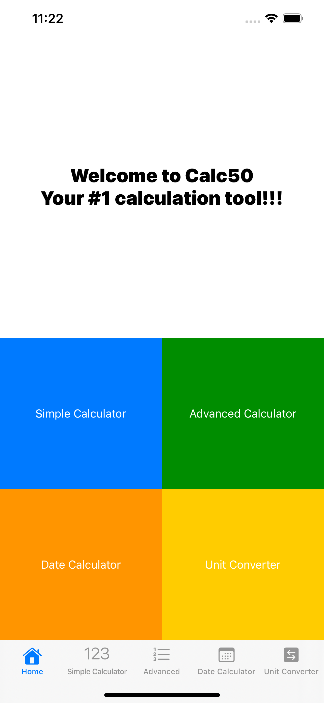
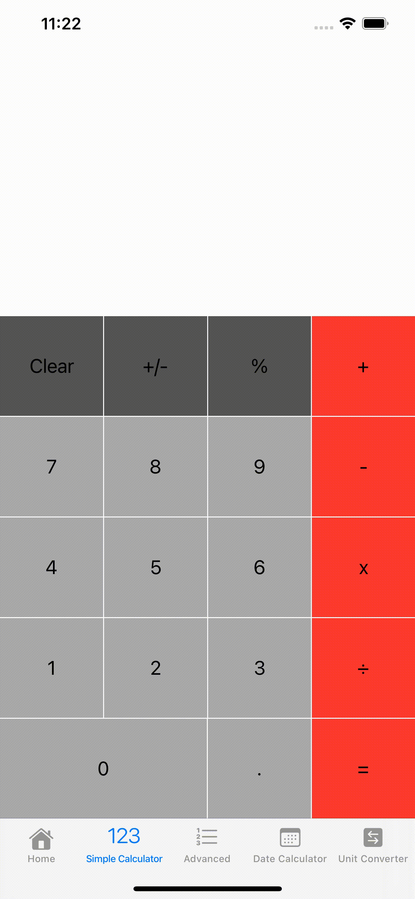
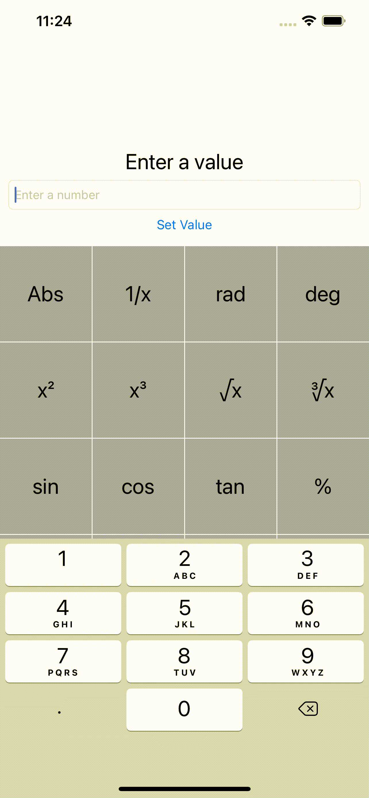

# Calc50 (iOS Mobile Application)
Calc50 is a mobile iOS calculator application built with Swift and Xcode. The application allows users to do simple and complex arithmetic calculations as well as unit conversion and calculations involving time and date.
## Getting Started
### Installation
- Clone this repository by running the terminal command `git clone git@github.com:bheki-maenetja/Calc50.git`
- Open the file `Calc50.xcodeproj` (you will need to install Xcode if you haven't already)
- To run the application click the play button in the top left hand side of your Xcode window

## Technologies Used
- Swift 5
- Xcode 10
- UIKit

## Overview
Calc50 is a mobile iOS calculator application built with Swift and Xcode. The application allows users to do simple and complex arithmetic calculations as well as unit conversion and calculations involving time and date. The app is comprised of four calculators: a simple arithmetic calculator, a calculator for more complex operations such as logarithmic and trigonometric functions, a unit converter and a calculator for calculating the time between two different dates.

<figcaption>The Home Screen</figcaption>


### Simple Calculator
- The simple calculator works much the same way as any other mobile calculator app. Users can perform simple calculations involving addition, subtraction, multiplication and division. Users can also work with percentages.



### Advanced Calculator
- The advanced calculator works by first asking the user to enter a number through a native keyboard provided by iOS. The user can then apply a multitude a mathematical functions including those related to trigonometry, logarithms, exponents and surds.



### Unit Converter
- The unit converter allows users to convert units of area, energy, length, mass, speed, temperature, time and volume. The user uses a series of UIPickerViews to select the category of units, the unit to be converted from and the unit to be converted to. The user will then enter an integer value to convert from the first unit to the second unit.


### Date Calculator
- The date calculator allows users to calculate the time between any two calendar dates. This time can be expressed in different units such as seconds, days, weeks and hours.


## Development
### Navigation
- Each calculator has its own view controller and each view controller is nested in a tab bar controller. This allows for the easy navigation between different calculators and the home page. Additionally, on the home page are four buttons that take the user to one of the four calculators. Rather than using segues to implement the functionality of the buttons I used an `@IBAction` function that changes the `selectedIndex` property of the parent tab bar controller
```
@IBAction func simpleCalcSegue(_ sender: UIButton) {
      switch String(sender.title(for: .normal)!) {
        case "Simple Calculator":
            self.tabBarController?.selectedIndex = 1
        case "Advanced Calculator":
            self.tabBarController?.selectedIndex = 2
        case "Date Calculator":
            self.tabBarController?.selectedIndex = 3
        case "Unit Converter":
            self.tabBarController?.selectedIndex = 4
        default:
            print("Nothing...")
      }
}
```
### Switch Statements
- Switch statements feature heavily in the code base of this app. On the simple calculator they are used to discern the symbol of the button that the user has just tapped; they're also used to determine what calculation should be performed if the symbol is an operator symbol. Switch statements on the advanced calculator have a similar purpose to those on the simple calculator. On the unit converter switch statments are used to implement the functionality of the UIPickerViews. The function `handleCategory` uses a switch statement to determine which conversion function to call, this depends on the name of the selected unit category. On the date calculator a switch statement is used to determine which unit of time in which to express the interval between the two chosen dates.
```
func calculateDateInterval(category : String) -> Int {
        switch category {
        case "seconds":
            let timeInterval = Calendar.current.dateComponents([.second], from: firstDatePicker.date, to: secondDatePicker.date)
            return Int(timeInterval.second!)
        case "minutes":
            let timeInterval = Calendar.current.dateComponents([.minute], from: firstDatePicker.date, to: secondDatePicker.date)
            return Int(timeInterval.minute!)
        case "hours":
            let timeInterval = Calendar.current.dateComponents([.hour], from: firstDatePicker.date, to: secondDatePicker.date)
            return Int(timeInterval.hour!)
        case "days":
            let timeInterval = Calendar.current.dateComponents([.day], from: firstDatePicker.date, to: secondDatePicker.date)
            return Int(timeInterval.day!)
        case "months":
            let timeInterval = Calendar.current.dateComponents([.month], from: firstDatePicker.date, to: secondDatePicker.date)
            return Int(timeInterval.month!)
        case "years":
            let timeInterval = Calendar.current.dateComponents([.year], from: firstDatePicker.date, to: secondDatePicker.date)
            return Int(timeInterval.year!)
        default:
            return -1
        }
}
```
## Reflection
### Challenges
- **Simple Calculator:** rather ironically, the hardest part of this project was the implementation of the 'simple calculator'. Firstly, this required the creation and implementation of a keyboard from scratch. Keeping track of what number the user had just typed as well as the current operator symbol and answer value proved to be quite challenging. Additionally, there were a myriad of other minor obstacles such as string validation, type conversion and the handling of decimal symbols.
- **Picker Views:** the implementation of `UIPickerView`s on the unit converter proved to be a bit of a challenge. The unit converter has three picker views: one for selecting the unit category and two for selecting the units that the user will convert to and from. I had trouble implementing functionality that would change the two unit picker views when the user selected a different category of units

### Room for Improvement
- **Code Refactoring:** given my lack of experience in Swift programming, much of the code base was written in a rudimentary fashion. There is a lot of repetitive code, especially with the code related to the unit converter; each unit category has its own conversion function; these functions are very similar in structure and can probably be refactored into one function that handles all unit conversions.
- **Design & Styling:** as with any app the design and styling can always be improved. On this app, I would like to include sound effects for when the user taps buttons on the simple and advanced calculators. I also feel that the date calculator and unit converter could use a more colourful colour scheme.

## Future Features
- **Currency Converter:** in addition to the four calculators in Calc50, in the future I would like to add a currency converter that would allow users to convert values in their local currency to international currencies around the world.
- **Financial Calculator:** this calculator would be geared for users that frequently have to do common finanacial calculations such as compound interest, mortgage rates and stock ratios. It would work much like the advanced calculator in which the user would have to fill in one or more parameters and press a button representing their selected calculation.